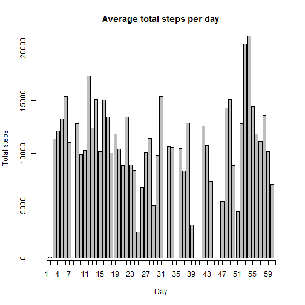
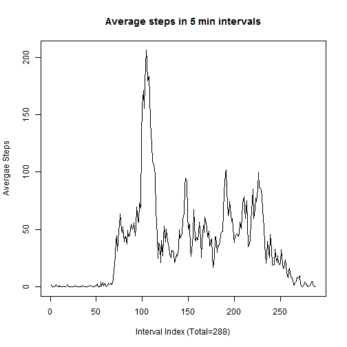
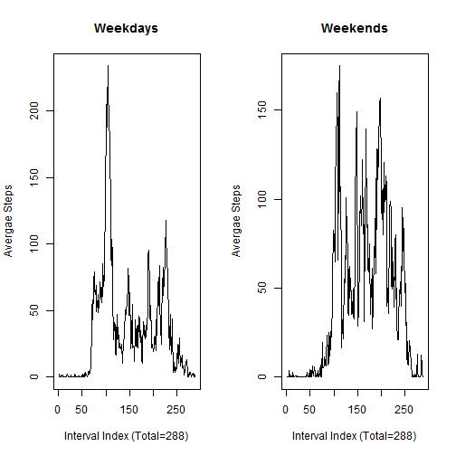

Reproducible Research Project 1 
========================================================

For the analysis for project 1, I carried out the following steps:

1 - The first step involves creating a new folder "reproducible research" and changing the directory. The data for analysis is downloaded using the provided link. Since it is .zip file, it is unzipped and all the content file are viwed using the list.files() command. 


```r
if (!file.exists("reproducible research")){dir.create("reproducible research")}
setwd(paste(getwd(),"/reproducible research",sep=""))
download.file("http://d396qusza40orc.cloudfront.net/repdata%2Fdata%2Factivity.zip", "./repdata1.zip")
unzip("./repdata1.zip")
list.files()
```

```
## [1] "activity.csv" "repdata1.zip"
```

2 - The activity.csv file is read into a data.frame called 'projData'. Factor variables to represent the 61 days are created and the factors are binded with projData. 


```r
projData<-read.csv("activity.csv")
day <- gl(61,288)
projData <- cbind(projData, day)
```

3 - A summary data frame is created that contains the total steps taken in the 61 days. Then a variable in the data.frame is renamed and the mean and median values for steps per day are calculated.


```r
byDay <- aggregate(projData["steps"],by=list(projData$day),FUN=sum, na.rm=0)
names(byDay)[1]<-"Day"
mean(byDay$steps,na.rm=TRUE)
```

```
## [1] 10766
```

```r
median(byDay$steps,na.rm=TRUE)
```

```
## [1] 10765
```


```r
plot <- barplot(byDay$steps)
axis(1, at=plot, labels=1:61)
title(main="Average total steps per day", xlab="Day", ylab="Total steps")
```

 

4 - The variable 'interval' is converted into a factor variable. Aggregate function is applied to abtain average steps in all 5 miute intervals ofa day over the period of two months. An index of the 288 intervals in a day is also appended to the obtained data.frame byInterval gotten as a result of aggregate function. A time series plot is finally created to show the results of the average steps over the 5 minute intervals.   


```r
projData$interval <- as.factor(projData$interval)
byInterval <- aggregate(projData["steps"],by=list(projData$interval),FUN=mean, na.rm=TRUE)
names(byInterval)[1] <- "interval"
byInterval <- cbind(interval_index=1:288, byInterval)
with(byInterval, plot(interval_index, steps, type='l',main="Average steps in 5 min intervals", xlab="Interval Index (Total=288)", ylab="Avergae Steps"))
```

 

5 - The maximum average steps calculate out to be taken in the **104th** 5 minute interval

```r
which(byInterval$steps==max(byInterval$steps))
```

```
## [1] 104
```

6 - To check the values of total no. of NA values in the steps variable

```r
table(is.na(projData$steps))
```

```
## 
## FALSE  TRUE 
## 15264  2304
```

7 - The following code identifies the indices of the NA values and replaces them with the mean steps of that particular day. Another factor variable differentiating between weekdays and weekends is also created


```r
naidx <- which(is.na(projData$steps)==TRUE)
nadays<- projData$day[naidx]
nameans <- byDay$steps[nadays]
projData$week <- as.factor(ifelse(weekdays(as.Date(projData$date)) %in% c("Saturday","Sunday"), "Weekend", "Weekday"))
projData$steps[naidx]=nameans
```

8 - Checking mean and median values after replacing NA values
*(The means are reduced as compared to the ones previously computed in step 3)*


```r
byDay <- aggregate(projData["steps"],by=list(projData$day),FUN=sum,na.rm=TRUE)
mean(byDay$steps,na.rm=TRUE)
```

```
## [1] 9354
```

```r
median(byDay$steps,na.rm=TRUE)
```

```
## [1] 10395
```

9 - Seperating weekday and weekend data (Average steps in the 5 minute intrvals of a day over 2 months) and the data is plotted to study the difference


```r
byInterval_wd <- aggregate(projData["steps"],by=list(projData$interval,projData$week),FUN=mean, na.rm=TRUE)
names(byInterval_wd)[1:2]<-c("interval","week")
byInterval_we<-byInterval_wd[byInterval_wd$week=="Weekend",]
byInterval_wd<-byInterval_wd[byInterval_wd$week=="Weekday",]
par(mfrow=c(1,2))
with(byInterval_wd, plot(1:288, steps, type='l',main="Weekdays", xlab="Interval Index (Total=288)", ylab="Avergae Steps"))
with(byInterval_we, plot(1:288, steps, type='l',main="Weekends", xlab="Interval Index (Total=288)", ylab="Avergae Steps"))
```

 

*(We observe different patterns on weekdays and on weekends. We observe that in weekends, the day starts a little late. The person tends to walk more on weekends which leads us to infer that the subject possibly has a desk job on weekdays.)*

**THANKYOU FOR STUDYING MY ANALYSIS REPORT!**
